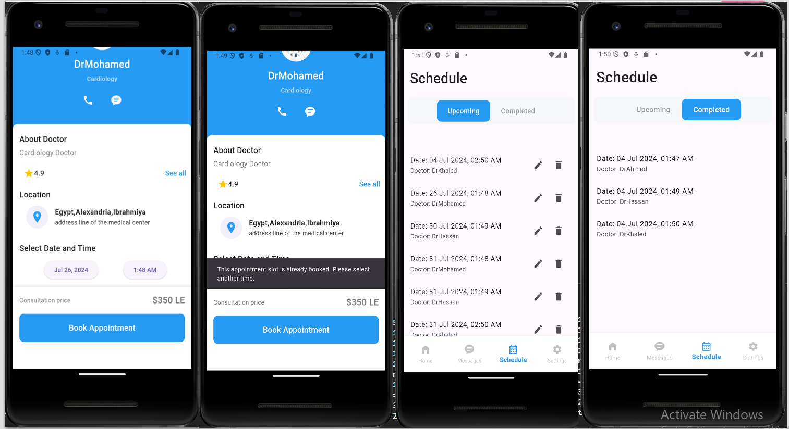

# Smart Healthcare Mobile App

## Table of Contents
- [Description](#description)
- [Features](#features)
- [Screenshots](#screenshots)
- [Technologies Used](#technologies-used)
- [Getting Started](#getting-started)
  - [Prerequisites](#prerequisites)
  - [Installation](#installation)
  - [Configuration](#configuration)
- [Usage](#usage)
- [Contributing](#contributing)
- [License](#license)

## Description
The Smart Healthcare Mobile App is a Flutter application designed to provide real-time monitoring of sensor data from ThingSpeak, facilitate scheduling of appointments for patients and doctors, and integrate with Firebase for authentication and data storage.

## Features
- **Real-Time Sensor Data:** Fetch and display sensor data (e.g., temperature, heart rate) from ThingSpeak.
- **Appointment Management:** Schedule appointments for patients and doctors.
- **Firebase Integration:** Securely store user data and handle authentication.

## Screenshots




## Technologies Used
- **Flutter:** Google's UI toolkit for building natively compiled applications for mobile, web, and desktop from a single codebase.
- **ThingSpeak:** IoT analytics platform service that allows you to aggregate, visualize, and analyze live data streams in the cloud.
- **Firebase:** Google's mobile and web application development platform that provides various backend services including a real-time database, authentication, analytics, and more.

## Getting Started

### Prerequisites
- **Flutter SDK:** Ensure you have Flutter installed. If not, follow the [installation guide](https://flutter.dev/docs/get-started/install).
- **Firebase Project:** Create a Firebase project in the [Firebase Console](https://console.firebase.google.com/). Enable Firebase services like Firestore, Authentication, etc.

- ### Installation
1. Clone the repository:
   ```bash
   git clone https://github.com/YourUsername/healthcare-app.git
   
## Configuration
### Firebase Setup:
Add your Flutter app to your Firebase project using the Firebase Console.
Download the google-services.json file and place it into the android/app directory for Android, or the GoogleService-Info.plist file into the ios/Runner directory for iOS.
### ThingSpeak Configuration:
Obtain your ThingSpeak channel API key.
Update the API key in the app code where sensor data is fetched.

### Usage
flutter run


